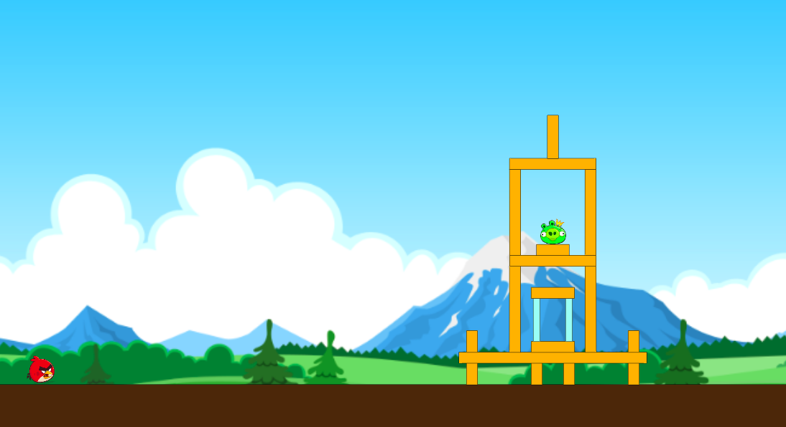

# Genetic Bird

A simple genetic algorithm for angry birds made in javascript.

# Libraries
I used the boxbox physics library for this project (http://incompl.github.io/boxbox/)

# Resources 
All images used in this project were taken from here: 

background: https://vignette.wikia.nocookie.net/angrybirdsfanon/images/3/39/Angry_Birds_Breakfast_2_background_better.png/revision/latest?cb=20140211154136
player: https://www.pavconhecimento.pt/includes/angrybirds/angry/img/red2.png

# Screenshots

